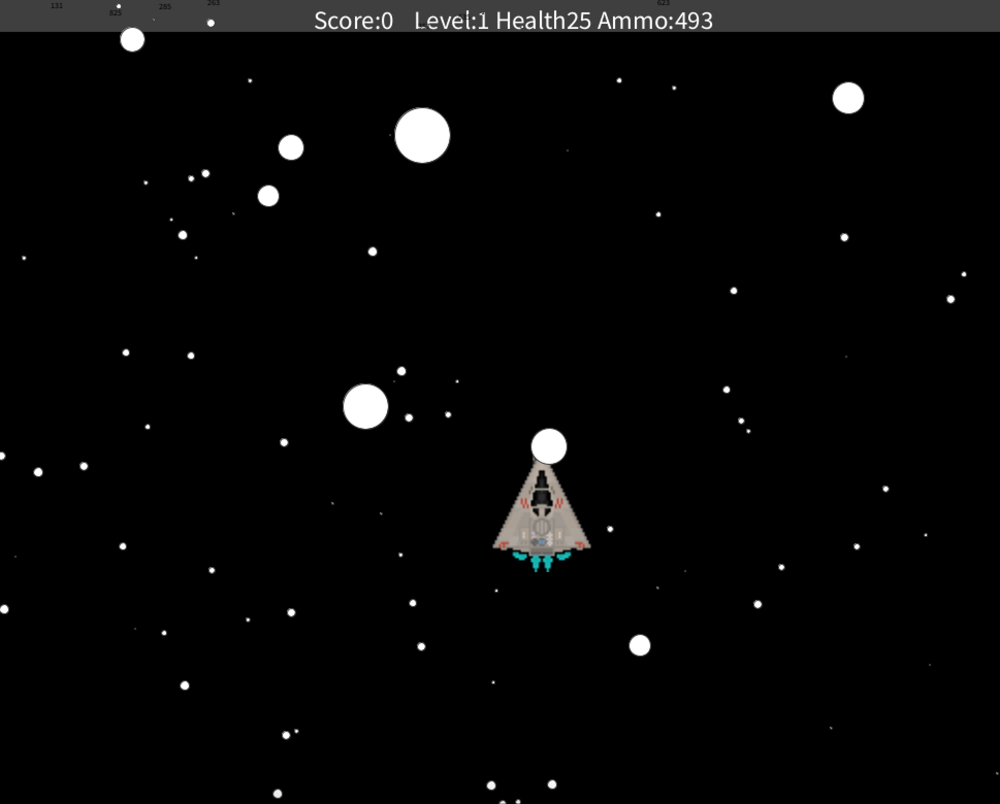

## Lilly Pernichele's programming one 2021-22 Portforlio 
My work in Skyline High School's Computer Programming One class, which focused on Processesing and Python.

### Processing Projects
 
#### Space Game 
OOP Solution for a collision based 2D Graphical Shooter

* [Source Code for App](https://github.com/foolbuffoon/programmingone22portfolio/blob/b352a6f875d712552dbdc493ad0cf129a1762ab3/src/Spacegame.zip)
#### Screensaver 
Basic graphical OOP exploration

* [Source Code for App](https://github.com/foolbuffoon/programmingone22portfolio/blob/f86909963d3299ec40b571a33406c3983032adf4/src/Screensaver.zip)
#### Timeline 

### Python Projects

#### Shapetester 
Python OOP Solution for a volume and surface area calculator for various shapes
